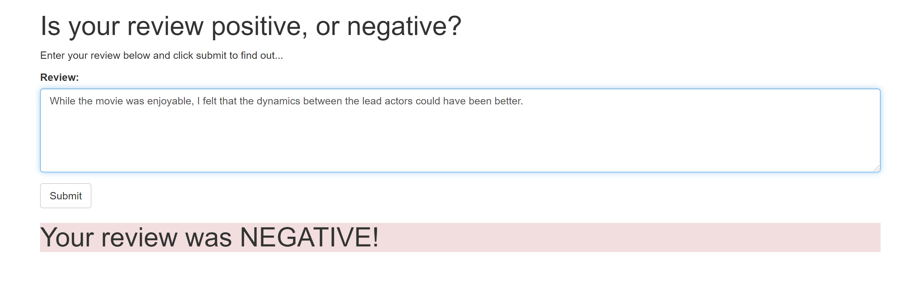

# Project Overview

This project implements simple web application which interacts with a deployed recurrent neural network performing sentiment analysis on movie reviews. The model is trained with XGBoost and deployed and trained using AWS SageMaker/Lambda/API Gateway, architecture could be seen in the diagram.

## Sample Output

### Classifier Result

